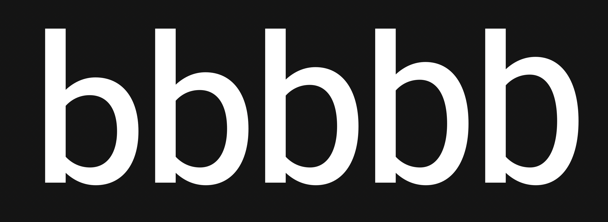

# abc github example font

**ABYSS type company**
*SIL Open Font License 1.1,*
*5 static fonts, 1 variable*

abc github example font. This font is an example font to learn the ins and outs, the dos and don'ts of collaborative type design with a git workflow. 

#### abc example font contains five Static & one Variable font with five ytlc instances:
* 480
* 504
* 528
* 552
* 576

To contribute to the project contact [Mirko Velimirovic](https://abysstypeco.github.io/).

### Designers

* Mirko Velimirovic

### License

Copyright (c) 2020, Abyss Type Co. (abysstypeco.github.io | bghryct@gmail.com)

Licensed under the [*SIL Open Font License, 1.1*](http://scripts.sil.org/OFL); you may not use this file except in compliance with the License. 

======
## FONTLOG for the abc example fonts

This file provides detailed information on the abc example font, font software.  
This information should be distributed along with the abc example fonts and any derivative works.

### abc example font is a typeface family that supports the following Unicode language range: 

* abc

*To contribute to the project contact Abyss Type Co. at bghryct@gmail.com*

**2020 December 12 (v1.000) Initial Commit (abyss-type-co)**
- Initial commit

### Acknowledgements

If you make modifications be sure to add your name (N), email (E), web-address
(if you have one) (W) and description (D). This list is in alphabetical order.

**N:** **Mirko Velimirovic**  
**E:** bghryct@gmail.com  
**W:** https://abysstypeco.github.io/  
**D:** Typeface development

